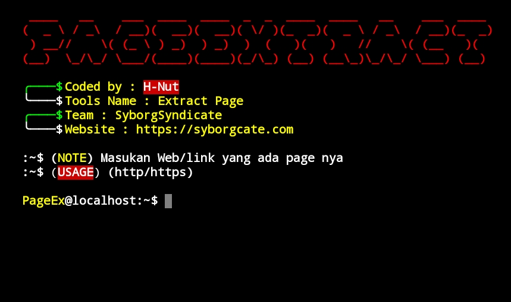
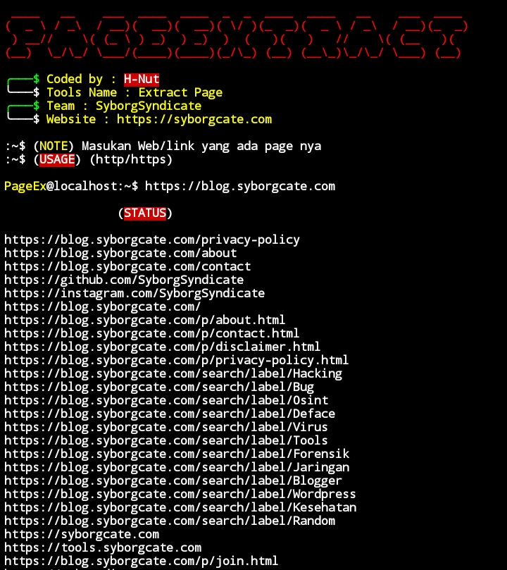

# PageExtract
This tool will parse the html of a website and extract links from the page. The hrefs or page links are displayed in plain text for easy copying or review

### Display✨

  

### Result⚡

  

